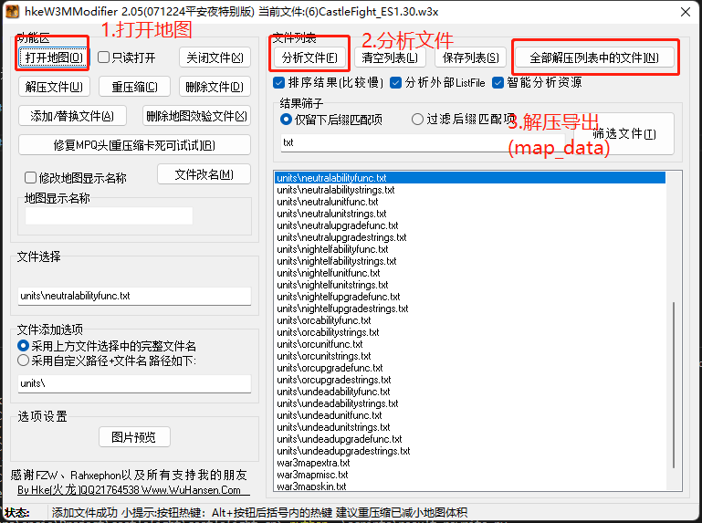

# 城堡战争汉化

- map_data: 地图的分析后数据
- map：地图原版

通过 HWM （hke W3M Modifier）分析后的 map 文件为 map_data 里的数据。翻译后重打包即可。

## 汉化字符串导入过程

### HWM 解压

需要注意，默认解压位置在地图所在位置，否则需要自己设置每次重新选择（在设置里）。

### 进行翻译

调用脚本处理。见脚本运行的 [README](scripts/README.md)。

### 替换脚本

在 HWM 中将解压后的文件进行替换（同名）。

### 重压缩

进行重压缩，就保存了。然后就可以尝试确认有没有问题了。

## 一些坑点

1. `*strings.txt` 文件看似 ini 文件但是并非标准 ini ，section 可能重名，所以自己处理了。
2. 看似 ini 文件的 `*strings.txt` 中，等号两端不能有空格，否则无法解析。